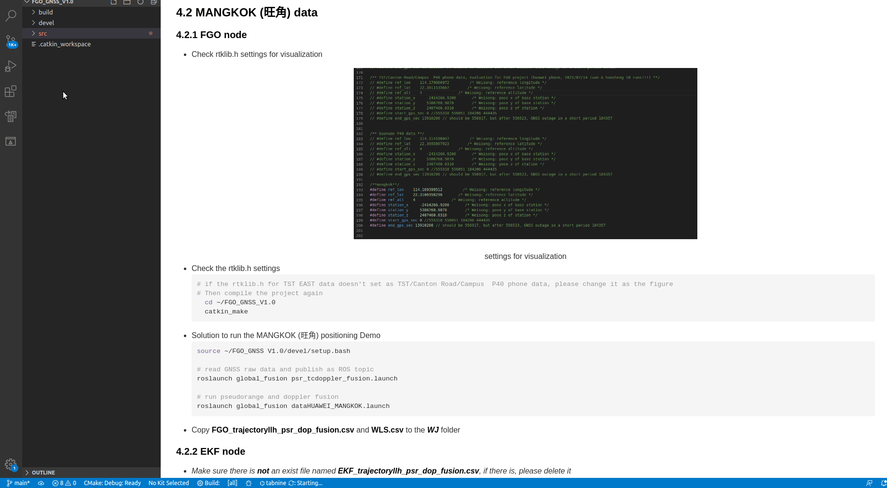

## 1. Prerequisites
<details>
  <summary>Click to expand the details</summary>
  
### 1.1 **Ubuntu** and **ROS**
Ubuntu 64-bit 16.04, ROS Kinetic. [ROS Installation](http://wiki.ros.org/ROS/Installation). We only test it on Ubuntu 16.04 with ROS Kinetic. 

### 1.2. **Ceres Solver**
Follow the following instructions to install Ceres-solver instead of using the latest version of Ceres-solver.

**Step 1**: Download the [Ceres-solver](https://github.com/weisongwen/FGO-GNSSV3.0/tree/master/support_files) which is compatible with FGO-GNSSV3.0. 

**Step 2**: make and install
```bash
sudo apt-get install cmake
# google-glog + gflags
sudo apt-get install libgoogle-glog-dev
# BLAS & LAPACK
sudo apt-get install libatlas-base-dev
# Eigen3
sudo apt-get install libeigen3-dev
# make Ceres-solver
mkdir ceres-bin
cd ceres-bin
cmake ../ceres-solver
sudo make -j4
sudo make test
sudo make install
```

### 1.3. **Extra Libraries**
```bash
sudo apt-get install ros-kinetic-novatel-msgs
```

</details>

## 2. Build
Clone the repository and catkin_make:
```bash
mkdir fgo_gnss/src
cd ~/fgo_gnss/src
mkdir result
git clone https://github.com/weisongwen/FGO-GNSS.git
cd ../
# if you fail in the last catkin_make, please source and catkin_make again
catkin_make
source ~/fgo_gnss/devel/setup.bash
catkin_make
```
(**if you fail in this step, try to find another computer with clean system or reinstall Ubuntu and ROS**)

## 3. Run GNSS positioning via dataset collected by the Huawei P40 Pro Phone (driving data)

<details>
  <summary>Click to expand the details to replicate the result</summary>

  Several parameters are as follows:
  - satellite system: **GPS/BeiDou**
  - Window Size: **Batch**
  - result is saved by default
    ```c++
    ~/fgo_gnss/src/global_fusion/FGO_trajectoryllh_psr_dop_fusion.csv
    ```

- Solution to run the GNSS positioning Demo
  ```bash
  source ~/fgo_gnss/devel/setup.bash

  # run pseudorange and doppler fusion
  roslaunch global_fusion psr_doppler_fusion.launch

  # read GNSS raw data and publish as ROS topic
  roslaunch global_fusion dataHuaweiPro_TST20201113.launch
  ```
- To evaluate the performance
  ```bash
  source ~/fgo_gnss/devel/setup.bash
  # read evaluation as follows
  roslaunch global_fusion evo_HuaweiPhoneTST.launch
  ```
<!-- <p align="center">
  
</p>
<center> How to run ?</center> -->

</details>
<p align="center">
  
</p>
<center> TST data collected by Huawei Phone: Red dots from WLS, purple curve from FGO</center>


## 4. Run GNSS positioning via dataset collected by the Huawei P40 Pro Phone (walking data)  via tightly coupled doppler factor
Several parameters are as follows:
  - satellite system: **GPS/BeiDou**
  - Window Size: **Batch**
  - result is saved by default
    ```c++
    ~/FGO_GNSS V3.0/src/global_fusion/FGO_trajectoryllh_psr_dop_fusion.csv
    ```
**Before testing the HONG KONG data**
- go to modify the file *src/FGO_GNSS_phase2/global_fusion/RTKLIB/src/pntpost.cpp* as follows:
  ```bash
   line 563 # doppler residual  
   line 564 v[nv]=-lam*obs[i].D[0]-(rate+x[3]-CLIGHT*dts[1+i*2]);
   line 565 #v[nv]=lam*obs[i].D[0]-(rate+x[3]-CLIGHT*dts[1+i*2]);  #/* for 2022 SH & Xi'an data */
  ```

  ```bash
   line 766  if(gnss_raw.elevation>15 && gnss_raw.snr>15)
   #default value is 15
  ```
- go to modify the file *src/FGO_GNSS_phase2/global_fusion/include/gnss_estimator/doppler_factor.hpp* as follows:
  ```bash
   line 93 #residuals[0] = (est_dop - doppler) / T(var); #// for huawei shanghai&xian dataset
   line 94 residuals[0] = (est_dop + doppler) / T(var); #// for huawei p40 phone and u-blox data 0.2 0.3
  ```

### 4.1 TST EAST (尖东) data

#### 4.1.1 FGO node 

<details>
  <summary>Click to expand the details</summary>

- Check rtklib.h settings for visualization
<p align="center">
  
</p>
<center> settings for visualization</center>

<p align="center">
  
</p>
<center> how to check</center>

- Check the rtklib.h settings
  ```bash
  
  # if the rtklib.h for TST EAST data doesn't set as TST/Canton Road/Campus  P40 phone data, please change it as the figure
  # Then compile the project again
    cd ~/FGO_GNSS_V3.0
    catkin_make 
  ```

- Solution to run the TST East(尖沙咀东) positioning Demo 
  ```bash
  source ~/FGO_GNSS V3.0/devel/setup.bash

  # read GNSS raw data and publish as ROS topic
  roslaunch global_fusion psr_tcdoppler_fusion.launch
  
  # run pseudorange and doppler fusion
  roslaunch global_fusion dataP40_1_Bag_TST20210714.launch
  ```


- Solution to run the TST East(尖沙咀东) positioning Demo using sliding window FGO
  ```bash
  source ~/FGO_GNSS V3.0/devel/setup.bash

  # read GNSS raw data and publish as ROS topic
  roslaunch global_fusion psr_tcdoppler_sw.launch
  
  # run pseudorange and doppler fusion
  roslaunch global_fusion dataP40_1_Bag_TST20210714.launch
  ```


- Solution to run the TST East(尖沙咀东) positioning Demo using batch FGO aided by GNC
  ```bash
  source ~/FGO_GNSS V3.0/devel/setup.bash

  # read GNSS raw data and publish as ROS topic
  roslaunch global_fusion psr_tcdoppler_batch_GNC.launch
  
  # run pseudorange and doppler fusion
  roslaunch global_fusion dataP40_1_Bag_TST20210714.launch
  ```
- Copy **FGO_trajectoryllh_psr_dop_fusion.csv** and **WLS.csv** to the ***TST_EAST*** folder


<p align="center">
  
</p>
<center> How to run ?</center>

- Copy **FGO_trajectoryllh_psr_dop_fusion.csv** and **WLS.csv** to the ***TST_EAST*** folder

<p align="center">
  
</p>
<center> The Specified folder</center>
</details>

#### 4.1.2 EKF node

<details>
  <summary>Click to expand the details</summary>

- *Make sure there is ***not*** an exist file named **EKF_trajectoryllh_psr_dop_fusion.csv**, if there is, please delete it*
- Check the log path of EKF in FGO_GNSS_V3.0/src/global_fusion/src/gnss_estimator/psr_doppler_fusion_EKF.cpp **line 544**, Change the path to the one you want, but do not change the output file name, then compile the project

<p align="center">
  
</p>
<center> how to check</center>


  ```bash
    cd ~/FGO_GNSS_V3.0
    catkin_make

  ```

<p align="center">
  
</p>
<center> EKF log path</center>

- Solution to run the TST East(尖沙咀东) positioning Demo (EKF) ekfpath
  ```bash
  source ~/FGO_GNSS V3.0/devel/setup.bash

  # read GNSS raw data and publish as ROS topic
  roslaunch global_fusion psr_doppler_fusion_EKF.launch
  
  # run pseudorange and doppler fusion
  roslaunch global_fusion dataP40_1_Bag_TST20210714.launch
  ```
- Cut **EKF_trajectoryllh_psr_dop_fusion.csv** to the ***TST_EAST*** folder

#### <span id="jump">4.1.3</span>  Evaluation
- There are 3 files should be evaluated, while you want to evaluate the FGO, please follow this: 'sol_folder'= 'FGO_trajectoryllh_psr_dop_fusion','trajectory_path' = 'trajectory.csv', 'error_path' = 'error.csv'

- For FGO evaluation:
<p align="center">
  
</p>
<center> FGO evaluation path</center>
- For EKF evaluation:
<p align="center">
  
</p>
<center> EKF evaluation path</center>
- For WLS evaluation:
<p align="center">
  
</p>
<center> WLS evaluation path</center>


- To evaluate the performance
  ```bash
  source ~/FGO_GNSS V3.0/devel/setup.bash
  # read evaluation as follows
 
  roslaunch global_fusion evo_TST.launch
  ```
 
</details>


### 4.2 MANGKOK (旺角) data

#### 4.2.1 FGO node 

<details>
  <summary>Click to expand the details</summary>
  
- Check rtklib.h settings for visualization


<p align="center">
  
</p>
<center> settings for visualization</center>

- Check the rtklib.h settings
  ```bash
  
  # if the rtklib.h for TST EAST data doesn't set as TST/Canton Road/Campus  P40 phone data, please change it as the figure
  # Then compile the project again
    cd ~/FGO_GNSS_V3.0
    catkin_make 
  ```

- Solution to run the MANGKOK (旺角) positioning Demo 
  ```bash
  source ~/FGO_GNSS V3.0/devel/setup.bash

  # read GNSS raw data and publish as ROS topic
  roslaunch global_fusion psr_tcdoppler_fusion.launch
  
  # run pseudorange and doppler fusion
  roslaunch global_fusion dataHUAWEI_MANGKOK.launch
  ```


- Solution to run the MANGKOK (旺角) positioning Demo using sliding window FGO
  ```bash
  source ~/FGO_GNSS V3.0/devel/setup.bash

  # read GNSS raw data and publish as ROS topic
  roslaunch global_fusion psr_tcdoppler_sw.launch
  
  # run pseudorange and doppler fusion
  roslaunch global_fusion dataHUAWEI_MANGKOK.launch
  ```

- Solution to run the MANGKOK (旺角) positioning Demo using batch FGO aided by GNC
  ```bash
  source ~/FGO_GNSS V3.0/devel/setup.bash

  # read GNSS raw data and publish as ROS topic
  roslaunch global_fusion psr_tcdoppler_batch_GNC.launch
  
  # run pseudorange and doppler fusion
  roslaunch global_fusion dataHUAWEI_MANGKOK.launch
  ```
- Copy **FGO_trajectoryllh_psr_dop_fusion.csv** and **WLS.csv** to the ***WJ*** folder
</details>


#### 4.2.2 EKF node
<details>
  <summary>Click to expand the details</summary>

- *Make sure there is ***not*** an exist file named **EKF_trajectoryllh_psr_dop_fusion.csv**, if there is, please delete it*
- Check the log path of EKF in FGO_GNSS_V3.0/src/global_fusion/src/gnss_estimator/psr_doppler_fusion_EKF.cpp **line 544**, Change the path to the one you want, but do not change the output file name, then compile the project (**If you have changed the log path, you can skip this step, but do not forget doing the first step**)
  ```bash
    cd ~/FGO_GNSS_V3.0 
    catkin_make

  ```

<p align="center">
  
</p>
<center> EKF log path</center>

- Solution to run the the MANGKOK (旺角) positioning Demo (EKF) ekfpath
  ```bash
  source ~/FGO_GNSS V3.0/devel/setup.bash

  # read GNSS raw data and publish as ROS topic
  roslaunch global_fusion psr_doppler_fusion_EKF.launch
  
  # run pseudorange and doppler fusion
  roslaunch global_fusion dataHUAWEI_MANGKOK.launch
  ```
- Cut **EKF_trajectoryllh_psr_dop_fusion.csv** to the ***WJ*** folder
</details>


#### 4.2.3 Evaluation
<details>
  <summary>Click to expand the details</summary>

- Change the evo_WJ.launch for evaluation as [4.1.3](#jump)
- To evaluate the performance
  ```bash
  source ~/FGO_GNSS V3.0/devel/setup.bash
  # read evaluation as follows
 
  roslaunch global_fusion evo_WJ.launch
  ```
</details>


### 4.3 Canton Road (广东道) data

#### 4.3.1 FGO node 
<details>
  <summary>Click to expand the details</summary>
- Check rtklib.h settings for visualization

<p align="center">
  
</p>
<center> settings for visualization</center>

- Check the rtklib.h settings
  ```bash
  
  # if the rtklib.h for TST EAST data doesn't set as TST/Canton Road/Campus  P40 phone data, please change it as the figure
  # Then compile the project again
    cd ~/FGO_GNSS_V3.0
    catkin_make 
  ```

- Solution to run the Canton Road (广东道) positioning Demo 
  ```bash
  source ~/FGO_GNSS V3.0/devel/setup.bash

  # read GNSS raw data and publish as ROS topic
  roslaunch global_fusion psr_tcdoppler_fusion.launch
  
  # run pseudorange and doppler fusion 
  roslaunch global_fusion dataHUAWEI_GDD.launch
  ```

- Solution to run the Canton Road (广东道) positioning Demo using sliding window FGO
  ```bash
  source ~/FGO_GNSS V3.0/devel/setup.bash

  # read GNSS raw data and publish as ROS topic
  roslaunch global_fusion psr_tcdoppler_sw.launch
  
  # run pseudorange and doppler fusion
  roslaunch global_fusion dataHUAWEI_GDD.launch
  ```

- Solution to run the Canton Road (广东道) positioning Demo using batch FGO aided by GNC
  ```bash
  source ~/FGO_GNSS V3.0/devel/setup.bash

  # read GNSS raw data and publish as ROS topic
  roslaunch global_fusion psr_tcdoppler_batch_GNC.launch
  
  # run pseudorange and doppler fusion
  roslaunch global_fusion dataHUAWEI_GDD.launch
  ```
- Copy **FGO_trajectoryllh_psr_dop_fusion.csv** and **WLS.csv** to the ***GDD*** folder
</details>


#### 4.3.2 EKF node
<details>
  <summary>Click to expand the details</summary>
- *Make sure there is ***not*** an exist file named **EKF_trajectoryllh_psr_dop_fusion.csv**, if there is, please delete it*
- Check the log path of EKF in FGO_GNSS_V3.0/src/global_fusion/src/gnss_estimator/psr_doppler_fusion_EKF.cpp **line 544**, Change the path to the one you want, but do not change the output file name, then compile the project (**If you have changed the log path, you can skip this step, but do not forget doing the first step**)
  ```bash
    cd ~/FGO_GNSS_V3.0 
    catkin_make

  ```

<p align="center">
  
</p>
<center> EKF log path</center>

- Solution to run the TST East(尖沙咀东) positioning Demo (EKF) ekfpath
  ```bash
  source ~/FGO_GNSS V3.0/devel/setup.bash

  # read GNSS raw data and publish as ROS topic
  roslaunch global_fusion psr_doppler_fusion_EKF.launch
  
  # run pseudorange and doppler fusion
  roslaunch global_fusion dataHUAWEI_GDD.launch
  ```
- Cut **EKF_trajectoryllh_psr_dop_fusion.csv** to the ***GDD*** folder
</details>


#### 4.3.3 Evaluation
<details>
  <summary>Click to expand the details</summary>

- Change the evo_GDD.launch for evaluation as [4.1.3](#jump)
- To evaluate the performance
  ```bash
  source ~/FGO_GNSS V3.0/devel/setup.bash
  # read evaluation as follows
 
  roslaunch global_fusion evo_GDD.launch
  ```
</details>


### 4.4 Tsuen Wan (荃湾) data

#### 4.4.1 FGO node 
<details>
  <summary>Click to expand the details</summary>

- Check rtklib.h settings for visualization

<p align="center">
  
</p>
<center> settings for visualization</center>

- Check the rtklib.h settings
  ```bash
  
  # if the rtklib.h for TST EAST data doesn't set as TST/Canton Road/Campus  P40 phone data, please change it as the figure
  # Then compile the project again
    cd ~/FGO_GNSS_V3.0
    catkin_make 
  ```

- Solution to run the Tsuen Wan (荃湾) positioning Demo 
  ```bash
  source ~/FGO_GNSS V3.0/devel/setup.bash

  # read GNSS raw data and publish as ROS topic
  roslaunch global_fusion psr_tcdoppler_fusion.launch
  
  # run pseudorange and doppler fusion
  roslaunch global_fusion dataHUAWEI_QW.launch
  ```

- Solution to run the Tsuen Wan (荃湾) positioning Demo using sliding window FGO
  ```bash
  source ~/FGO_GNSS V3.0/devel/setup.bash

  # read GNSS raw data and publish as ROS topic
  roslaunch global_fusion psr_tcdoppler_sw.launch
  
  # run pseudorange and doppler fusion
  roslaunch global_fusion dataHUAWEI_QW.launch
  ```

- Solution to run the Tsuen Wan (荃湾) positioning Demo using batch FGO aided by GNC
  ```bash
  source ~/FGO_GNSS V3.0/devel/setup.bash

  # read GNSS raw data and publish as ROS topic
  roslaunch global_fusion psr_tcdoppler_batch_GNC.launch
  
  # run pseudorange and doppler fusion
  roslaunch global_fusion dataHUAWEI_QW.launch
  ```
- Copy **FGO_trajectoryllh_psr_dop_fusion.csv** and **WLS.csv** to the ***QW*** folder
</details>


#### 4.4.2 EKF node
<details>
  <summary>Click to expand the details</summary>

- *Make sure there is ***not*** an exist file named **EKF_trajectoryllh_psr_dop_fusion.csv**, if there is, please delete it*
- Check the log path of EKF in FGO_GNSS_V3.0/src/global_fusion/src/gnss_estimator/psr_doppler_fusion_EKF.cpp **line 544**, Change the path to the one you want, but do not change the output file name, then compile the project (**If you have changed the log path, you can skip this step, but do not forget doing the first step**)
  ```bash
    cd ~/FGO_GNSS_V3.0 
    catkin_make

  ```

<p align="center">
  
</p>
<center> EKF log path</center>

- Solution to run the Tsuen Wan (荃湾) positioning Demo (EKF) ekfpath
  ```bash
  source ~/FGO_GNSS V3.0/devel/setup.bash

  # read GNSS raw data and publish as ROS topic
  roslaunch global_fusion psr_doppler_fusion_EKF.launch
  
  # run pseudorange and doppler fusion
  roslaunch global_fusion dataHUAWEI_QW.launch
  ```
- Cut **EKF_trajectoryllh_psr_dop_fusion.csv** to the ***QW*** folder
</details>


#### 4.4.3 Evaluation
<details>
  <summary>Click to expand the details</summary>

- Change the evo_GDD.launch for evaluation as [4.1.3](#jump)
- To evaluate the performance
  ```bash
  source ~/FGO_GNSS V3.0/devel/setup.bash
  # read evaluation as follows
 
  roslaunch global_fusion evo_QW.launch
  ```
</details>


### 4.5 Campus (高层小区) data

#### 4.5.1 FGO node 
<details>
  <summary>Click to expand the details</summary>

- Check rtklib.h settings for visualization

<p align="center">
  
</p>
<center> settings for visualization</center>

- Check the rtklib.h settings
  ```bash
  
  # if the rtklib.h for TST EAST data doesn't set as TST/Canton Road/Campus  P40 phone data, please change it as the figure
  # Then compile the project again
    cd ~/FGO_GNSS_V3.0
    catkin_make 
  ```

- Solution to run the Campus (高层小区) positioning Demo 
  ```bash
  source ~/FGO_GNSS V3.0/devel/setup.bash

  # read GNSS raw data and publish as ROS topic
  roslaunch global_fusion psr_tcdoppler_fusion.launch
  
  # run pseudorange and doppler fusion
  roslaunch global_fusion dataHUAWEI_CAMPUS.launch
  ```

- Solution to run the Campus (高层小区) positioning Demo using sliding window FGO
  ```bash
  source ~/FGO_GNSS V3.0/devel/setup.bash

  # read GNSS raw data and publish as ROS topic
  roslaunch global_fusion psr_tcdoppler_sw.launch
  
  # run pseudorange and doppler fusion
  roslaunch global_fusion dataHUAWEI_CAMPUS.launch
  ```

- Solution to run the Campus (高层小区) positioning Demo using batch FGO aided by GNC
  ```bash
  source ~/FGO_GNSS V3.0/devel/setup.bash

  # read GNSS raw data and publish as ROS topic
  roslaunch global_fusion psr_tcdoppler_batch_GNC.launch
  
  # run pseudorange and doppler fusion
  roslaunch global_fusion dataHUAWEI_CAMPUS.launch
  ```
- Copy **FGO_trajectoryllh_psr_dop_fusion.csv** and **WLS.csv** to the ***CAMPUS*** folder

</details>


#### 4.5.2 EKF node
<details>
  <summary>Click to expand the details</summary>

- *Make sure there is ***not*** an exist file named **EKF_trajectoryllh_psr_dop_fusion.csv**, if there is, please delete it*
- Check the log path of EKF in FGO_GNSS_V3.0/src/global_fusion/src/gnss_estimator/psr_doppler_fusion_EKF.cpp **line 544**, Change the path to the one you want, but do not change the output file name, then compile the project (**If you have changed the log path, you can skip this step, but do not forget doing the first step**)
  ```bash
    cd ~/FGO_GNSS_V3.0 
    catkin_make

  ```

<p align="center">
  
</p>
<center> EKF log path</center>

- Solution to run the Campus (高层小区) positioning Demo (EKF) ekfpath
  ```bash
  source ~/FGO_GNSS V3.0/devel/setup.bash

  # read GNSS raw data and publish as ROS topic
  roslaunch global_fusion psr_doppler_fusion_EKF.launch
  
  # run pseudorange and doppler fusion
  roslaunch global_fusion dataHUAWEI_CAMPUS.launch
  ```
- Cut **EKF_trajectoryllh_psr_dop_fusion.csv** to the ***CAMPUS*** folder
</details>


#### 4.5.3 Evaluation
<details>
  <summary>Click to expand the details</summary>

- Change the evo_GDD.launch for evaluation as [4.1.3](#jump)
- To evaluate the performance
  ```bash
  source ~/FGO_GNSS V3.0/devel/setup.bash
  # read evaluation as follows
 
  roslaunch global_fusion evo_CAMPUS.launch
  ```
</details>


## 5. Run GNSS positioning via dataset collected in Shang Hai via tightly coupled doppler factor
Several parameters are as follows:
  - satellite system: **GPS/BeiDou**
  - result is saved by default
    ```c++
    ~/FGO_GNSS V3.0/src/global_fusion/FGO_trajectoryllh_psr_dop_fusion.csv
    ```

**Before testing the SHANG HAI's data**
- go to modify the file *src/FGO_GNSS_phase2/global_fusion/RTKLIB/src/pntpost.cpp* as follows:
  ```bash
   line 563 # doppler residual  
   line 564 #v[nv]=-lam*obs[i].D[0]-(rate+x[3]-CLIGHT*dts[1+i*2]);
   line 565 v[nv]=lam*obs[i].D[0]-(rate+x[3]-CLIGHT*dts[1+i*2]);  #/* for 2022 SH & Xi'an data */
  ```

  ```bash
   line 766  if(gnss_raw.elevation>15 && gnss_raw.snr>20)
   #default value is 15
  ```
- go to modify the file *src/FGO_GNSS_phase2/global_fusion/include/gnss_estimator/doppler_factor.hpp* as follows:
  ```bash
   line 93 residuals[0] = (est_dop - doppler) / T(var); #// for huawei shanghai&xian dataset
   line 94 #residuals[0] = (est_dop + doppler) / T(var); #// for huawei p40 phone and u-blox data 0.2 0.3
  ```

### 5.1 ZLL data

#### 5.1.1 FGO node 

<details>
  <summary>Click to expand the details</summary>

- Check rtklib.h settings for visualization
<p align="center">
  
</p>
<center> settings for visualization</center>


- Check the rtklib.h settings
  ```bash
  
  # if the rtklib.h for TST EAST data doesn't set as TST/Canton Road/Campus  P40 phone data, please change it as the figure
  # Then compile the project again
    cd ~/FGO_GNSS_V3.0
    catkin_make 
  ```

- Solution to run the ZLL positioning Demo using sliding window FGO aided by GNC
  ```bash
  source ~/FGO_GNSS V3.0/devel/setup.bash

  # read GNSS raw data and publish as ROS topic
  roslaunch global_fusion psr_tcdoppler_sw_ZLL.launch
  
  # run pseudorange and doppler fusion
  roslaunch global_fusion dataHUAWEI_220113.launch
  ```


- Solution to run the ZLL positioning Demo using batch FGO aided by GNC
  ```bash
  source ~/FGO_GNSS V3.0/devel/setup.bash

  # read GNSS raw data and publish as ROS topic
  roslaunch global_fusion psr_tcdoppler_batch_GNC.launch
  
  # run pseudorange and doppler fusion
  roslaunch global_fusion dataHUAWEI_220113.launch
  ```


<p align="center">
  
</p>
<center> How to run ?</center>


<p align="center">
  
</p>
<center> The Specified folder</center>
</details>

#### <span id="jump">5.1.2</span>  Evaluation
- To evaluate the performance
  ```bash
  source ~/FGO_GNSS V3.0/devel/setup.bash
  # read evaluation as follows
 
  roslaunch global_fusion evo_220113.launch
  ```
</details>


### 5.2 LJZLD data

#### 5.2.1 FGO node 

<details>
  <summary>Click to expand the details</summary>

- Check rtklib.h settings for visualization
<p align="center">
  
</p>
<center> settings for visualization</center>


- Check the rtklib.h settings
  ```bash
  
  # if the rtklib.h for TST EAST data doesn't set as TST/Canton Road/Campus  P40 phone data, please change it as the figure
  # Then compile the project again
    cd ~/FGO_GNSS_V3.0
    catkin_make 
  ```

- Solution to run the LJJLD positioning Demo using sliding window FGO aided by GNC
  ```bash
  source ~/FGO_GNSS V3.0/devel/setup.bash

  # read GNSS raw data and publish as ROS topic
  roslaunch global_fusion psr_tcdoppler_sw_LJJLD.launch
  
  # run pseudorange and doppler fusion
  roslaunch global_fusion dataHUAWEI_220120_LJJLD.launch
  ```


- Solution to run the LJJLD positioning Demo using batch FGO aided by GNC
  ```bash
  source ~/FGO_GNSS V3.0/devel/setup.bash

  # read GNSS raw data and publish as ROS topic
  roslaunch global_fusion psr_tcdoppler_batch_GNC.launch
  
  # run pseudorange and doppler fusion
  roslaunch global_fusion dataHUAWEI_220120_LJJLD.launch
  ```


<p align="center">
  
</p>
<center> How to run ?</center>


<p align="center">
  
</p>
<center> The Specified folder</center>
</details>

#### <span id="jump">5.2.2</span>  Evaluation
- To evaluate the performance
  ```bash
  source ~/FGO_GNSS V3.0/devel/setup.bash
  # read evaluation as follows
 
  roslaunch global_fusion evo_220120_LJJLD.launch
  ```
</details>

### 5.3 WG data

#### 5.3.1 FGO node 

<details>
  <summary>Click to expand the details</summary>

- Check rtklib.h settings for visualization
<p align="center">
  
</p>
<center> settings for visualization</center>


- Check the rtklib.h settings
  ```bash
  
  # if the rtklib.h for TST EAST data doesn't set as TST/Canton Road/Campus  P40 phone data, please change it as the figure
  # Then compile the project again
    cd ~/FGO_GNSS_V3.0
    catkin_make 
  ```

- Solution to run the WG positioning Demo using sliding window FGO aided by GNC
  ```bash
  source ~/FGO_GNSS V3.0/devel/setup.bash

  # read GNSS raw data and publish as ROS topic
  roslaunch global_fusion psr_tcdoppler_sw_WG.launch
  
  # run pseudorange and doppler fusion
  roslaunch global_fusion dataHUAWEI_220120_WG.launch
  ```


- Solution to run the WG positioning Demo using batch FGO aided by GNC
  ```bash
  source ~/FGO_GNSS V3.0/devel/setup.bash

  # read GNSS raw data and publish as ROS topic
  roslaunch global_fusion psr_tcdoppler_batch_GNC.launch
  
  # run pseudorange and doppler fusion
  roslaunch global_fusion dataHUAWEI_220120_WG.launch
  ```


<p align="center">
  
</p>
<center> How to run ?</center>


<p align="center">
  
</p>
<center> The Specified folder</center>
</details>

#### <span id="jump">5.3.2</span>  Evaluation
- To evaluate the performance
  ```bash
  source ~/FGO_GNSS V3.0/devel/setup.bash
  # read evaluation as follows
 
  roslaunch global_fusion evo_220120_WG.launch
  ```
</details>

### 5.4 NJDL data

#### 5.4.1 FGO node 

<details>
  <summary>Click to expand the details</summary>

- Check rtklib.h settings for visualization
<p align="center">
  
</p>
<center> settings for visualization</center>


- Check the rtklib.h settings
  ```bash
  
  # if the rtklib.h for TST EAST data doesn't set as TST/Canton Road/Campus  P40 phone data, please change it as the figure
  # Then compile the project again
    cd ~/FGO_GNSS_V3.0
    catkin_make 
  ```

- Solution to run the NJDL positioning Demo using sliding window FGO aided by GNC
  ```bash
  source ~/FGO_GNSS V3.0/devel/setup.bash

  # read GNSS raw data and publish as ROS topic
  roslaunch global_fusion psr_tcdoppler_sw_NJDL.launch
  
  # run pseudorange and doppler fusion
  roslaunch global_fusion dataHUAWEI_220125_NJDL.launch
  ```


- Solution to run the NJDL positioning Demo using batch FGO aided by GNC
  ```bash
  source ~/FGO_GNSS V3.0/devel/setup.bash

  # read GNSS raw data and publish as ROS topic
  roslaunch global_fusion psr_tcdoppler_batch_GNC.launch
  
  # run pseudorange and doppler fusion
  roslaunch global_fusion dataHUAWEI_220125_NJDL.launch
  ```


<p align="center">
  
</p>
<center> How to run ?</center>


<p align="center">
  
</p>
<center> The Specified folder</center>
</details>

#### <span id="jump">5.4.2</span>  Evaluation
- To evaluate the performance
  ```bash
  source ~/FGO_GNSS V3.0/devel/setup.bash
  # read evaluation as follows
 
  roslaunch global_fusion evo_220125_NJDL.launch
  ```
</details>


### 5.5 YSTYG data

#### 5.5.1 FGO node 

<details>
  <summary>Click to expand the details</summary>

- Check rtklib.h settings for visualization
<p align="center">
  
</p>
<center> settings for visualization</center>


- Check the rtklib.h settings
  ```bash
  
  # if the rtklib.h for TST EAST data doesn't set as TST/Canton Road/Campus  P40 phone data, please change it as the figure
  # Then compile the project again
    cd ~/FGO_GNSS_V3.0
    catkin_make 
  ```

- Solution to run the YSTYG positioning Demo using sliding window FGO aided by GNC
  ```bash
  source ~/FGO_GNSS V3.0/devel/setup.bash

  # read GNSS raw data and publish as ROS topic
  roslaunch global_fusion psr_tcdoppler_sw_YSTYG.launch
  
  # run pseudorange and doppler fusion
  roslaunch global_fusion dataHUAWEI_220125_YSTYG.launch
  ```


- Solution to run the YSTYG positioning Demo using batch FGO aided by GNC
  ```bash
  source ~/FGO_GNSS V3.0/devel/setup.bash

  # read GNSS raw data and publish as ROS topic
  roslaunch global_fusion psr_tcdoppler_batch_GNC.launch
  
  # run pseudorange and doppler fusion
  roslaunch global_fusion dataHUAWEI_220125_YSTYG.launch
  ```


<p align="center">
  
</p>
<center> How to run ?</center>


<p align="center">
  
</p>
<center> The Specified folder</center>
</details>

#### <span id="jump">5.5.2</span>  Evaluation
- To evaluate the performance
  ```bash
  source ~/FGO_GNSS V3.0/devel/setup.bash
  # read evaluation as follows
 
  roslaunch global_fusion evo_220125_YSTYG.launch
  ```
</details>


## 6. Run GNSS positioning via dataset MANGKOK (walking data)  via SDM Factor & adaptive sliding windows
**Before testing the Mangkok-3DMA data**
- go to modify the file *src/FGO_GNSS_phase2/global_fusion/RTKLIB/src/pntpost.cpp* as follows:
  ```bash
   line 563 # doppler residual  
   line 564 v[nv]=-lam*obs[i].D[0]-(rate+x[3]-CLIGHT*dts[1+i*2]);
   line 565 #v[nv]=lam*obs[i].D[0]-(rate+x[3]-CLIGHT*dts[1+i*2]);  #/* for 2022 SH & Xi'an data */
  ```

  ```bash
   line 766  if(gnss_raw.elevation>15 && gnss_raw.snr>15)
   #default value is 15
  ```
- go to modify the file *src/FGO_GNSS_phase2/global_fusion/include/gnss_estimator/doppler_factor.hpp* as follows:
  ```bash
   line 93 #residuals[0] = (est_dop - doppler) / T(var); #// for huawei shanghai&xian dataset
   line 94 residuals[0] = (est_dop + doppler) / T(var); #// for huawei p40 phone and u-blox data 0.2 0.3
  ```

### 6.1 FGO-3DMA node 

<details>
  <summary>Click to expand the details</summary>

- Check rtklib.h settings for visualization
<p align="center">
  
</p>
<center> settings for visualization</center>


- Check the rtklib.h settings
  ```bash
  
  # if the rtklib.h for TST EAST data doesn't set as TST/Canton Road/Campus  P40 phone data, please change it as the figure
  # Then compile the project again
    cd ~/FGO_GNSS_V3.0
    catkin_make 
  ```

- Solution to run the MANGKOK positioning Demo using sliding window FGO aided by 3DMA factor
  ```bash
  source ~/FGO_GNSS V3.0/devel/setup.bash

  # read GNSS raw data and publish as ROS topic
  roslaunch global_fusion psr_tcdoppler_sw_MK_3DMA.launch
  
  # run pseudorange and doppler fusion
  roslaunch global_fusion dataHUAWEI_MANGKOK.launch
  ```

- Evaluation
  ```bash
  source ~/FGO_GNSS V3.0/devel/setup.bash

  # read GNSS raw data and publish as ROS topic
  roslaunch global_fusion evo_WJ_3DMA.launch
  ```


</details>

## 7. Acknowledgements
We use [Ceres-solver](http://ceres-solver.org/) for non-linear optimization and [RTKLIB](http://www.rtklib.com/) for GNSS data decoding, etc. If there is any thing inappropriate, please contact me through 17902061r@connect.polyu.hk ([Weisong WEN](https://weisongwen.wixsite.com/weisongwen)).


## 8. License
The source code is released under [GPLv3](http://www.gnu.org/licenses/) license. We are still working on improving the code reliability. For any technical issues, please contact Weisong Wen <17902061r@connect.polyu.hk>. For commercial inquiries, please contact Li-ta Hsu <lt.hsu@polyu.edu.hk>.
